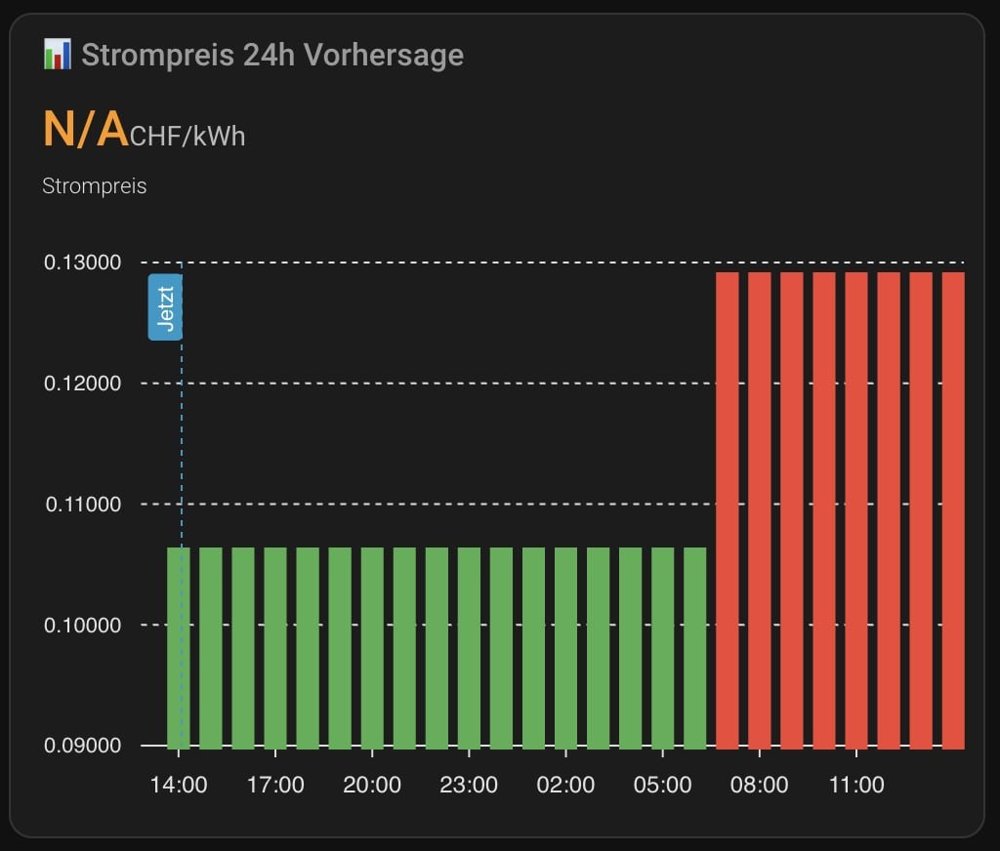

# SEC Energy Swiss Tariffs - Home Assistant Integration

[](https://github.com/custom-components/hacs)
[](https://opensource.org/licenses/MIT)

Home Assistant Integration für schweizer Stromtarife im SEC-Energy JSON-Format. Unterstützt dynamische Tarifauswahl, Echtzeit-Preise und 24h-Vorhersage.



## Features

- 🔌 **Mehrere Stromversorger** - Unterstützt alle SEC-Energy-kompatiblen APIs
- 📊 **Dynamische Tarifauswahl** - Tarife werden live von der API geladen
- ⚡ **Aktueller Preis** - Echtzeit-Strompreis basierend auf Tageszeit
- 📈 **24h Vorhersage** - Visualisiere die Preise für die nächsten 24 Stunden
- 💰 **Kostenberechnung** - Verbrauch × Preis = Kosten
- 🔄 **Automatischer Tarif-Wechsel** - Hochtarif/Niedertarif automatisch erkannt

## Unterstützte Anbieter (93+ Schweizer Stromversorger)

Die Integration unterstützt alle SEC-Energy-kompatiblen APIs. Hier eine Auswahl:

| Anbieter | Region |
|----------|--------|
| AEW | Aargau |
| Arbon Energie AG | Thurgau |
| ACA Airolo | Ticino |
| SH POWER | Schaffhausen |
| Commune de Paudex | Vaud |
| Comune di Stabio | Ticino |
| EGH Hünenberg | Zug |
| Technische Betriebe Birmenstorf | Aargau |
| Elektrizitätswerk Muhen | Aargau |
| Elektrizitätsversorgung Villigen (EVV) | Aargau |
| Elektrizitäts- und Wasserwerk Windisch | Aargau |
| Elektrizitätsversorgung Zeihen (EVZ) | Aargau |
| Elektra Genossenschaft Arni-Islisberg | Aargau |
| Elektra Horn AG | Thurgau |
| Elektra-Korporation Wolfhalden EKW | Appenzell |
| Elektra Mettauertal | Aargau |
| Elektra Remetschwil | Aargau |
| Elektrizitätsgenossenschaft Mellingen | Aargau |
| Elektrizitäts-Genossenschaft Merenschwand | Aargau |
| Elektra Aristau | Aargau |
| Elektra Beinwil | Aargau |
| Elektrizitätswerk Hefenhofen | Thurgau |
| Elektra Hermetschwil | Aargau |
| Elektrizitätsgenossenschaft Jonen | Aargau |
| Elektrizitätsgenossenschaft Mühlau | Aargau |
| Elektrizitätsgenossenschaft Otelfingen (EGO) | Zürich |
| Elektrizitätsgenossenschaft Rümikon | Zürich |
| Elektra Oberrohrdorf (EOR) | Aargau |
| IB Wohlen AG | Aargau |
| Stadtwerke Schaffhausen (SGSW) | Schaffhausen |
| Stadtwerke Wetzikon | Zürich |
| **+ 60 weitere Anbieter** | **Schweizweit** |
| Custom / Other | Beliebige SEC-Energy-kompatible URL |

## Installation

### HACS (empfohlen)

1. HACS → Integrationen → Benutzerdefinierte Repositories
2. URL: `https://github.com/marcelloceschia/ha-ch-energy`
3. Kategorie: Integration
4. Installieren → Neustart

### Manuell

1. Kopiere den `sec_energy` Ordner nach `<config>/custom_components/`
2. Home Assistant neu starten

## Konfiguration

### Schritt 1: Integration hinzufügen

1. Einstellungen → Geräte & Dienste → Integration hinzufügen
2. "SEC Energy Swiss Tariffs" suchen

### Schritt 2: Stromversorger wählen

Wähle deinen Stromversorger aus der Liste oder gib eine eigene API-URL ein.

### Schritt 3: Tarif auswählen

Alle verfügbaren Tarife werden dynamisch von der API geladen. Wähle deinen Tarif (z.B. "S-Standard", "S-100 T", etc.).

## Erstellte Entitäten

### Haupt-Sensoren (mit DSO-Namen)

| Entität | Beschreibung |
|---------|-------------|
| `sensor.{dso_name}_aktueller_preis` | Aktueller Strompreis (CHF/kWh) |
| `sensor.{dso_name}_preisvorhersage` | Preisvorhersage 24h (Attribute: `forecast`) |
| `sensor.{dso_name}_grundgebuehr` | Monatliche Grundgebühr (CHF) |

**Hinweis:** `{dso_name}` wird während der Einrichtung festgelegt (z.B. `stadtwerke_wetzikon`).

### Alias Template-Sensoren (optional)

Kopiere [`templates/sec_energy_aliases.yaml`](templates/sec_energy_aliases.yaml) in deine Home Assistant Konfiguration und passe den DSO-Namen an:

```yaml
# In configuration.yaml:
template: !include templates/sec_energy_aliases.yaml
```

Dies erstellt folgende kurze Entitätsnamen:

| Entität | Beschreibung |
|---------|-------------|
| `sensor.strompreis_aktuell` | Aktueller Strompreis |
| `sensor.strompreis_forecast` | 24h Vorhersage (Attribut: `forecast`) |
| `sensor.strompreis_grundgebuehr` | Grundgebühr/Monat |
| `sensor.strompreis_ist_hochtarif` | `true`/`false` |
| `sensor.strompreis_naechste_stunde` | Preis nächste Stunde |
| `sensor.strompreis_tiefster_heute` | Tiefster Preis heute |
| `sensor.strompreis_hoechster_heute` | Höchster Preis heute |
| `sensor.strompreis_durchschnitt_heute` | Durchschnittspreis heute |
| `sensor.strompreis_kostenvoranschlag_heute` | Geschätzte Kosten heute |

## Dashboard-Karten

### Preisvorhersage mit ApexCharts

```yaml
type: custom:apexcharts-card
header:
  show: true
  title: 📊 Strompreis 24h Vorhersage
graph_span: 24h
series:
  - entity: sensor.strompreis_vorhersage
    type: column
    data_generator: |
      const forecast = entity.attributes.forecast;
      return forecast.map(item => [new Date(item.hour).getTime(), item.price]);
```

### Übersichtskarte

```yaml
type: entities
title: ⚡ Strompreis Übersicht
entities:
  - sensor.strompreis_aktuell
  - sensor.strompreis_ist_hochtarif
  - sensor.strompreis_naechste_stunde
  - sensor.strompreis_tiefster_heute
  - sensor.strompreis_hoechster_heute
  - sensor.strompreis_grundgebuehr
```

## Automatisierungen

### Waschmaschine nur bei Niedertarif starten

```yaml
automation:
  - alias: "Waschmaschine bei Niedertarif starten"
    trigger:
      - platform: state
        entity_id: sensor.strompreis_ist_hochtarif
        to: "false"
    condition:
      - condition: state
        entity_id: input_boolean.waschmaschine_bereit
        state: "on"
    action:
      - service: switch.turn_on
        target:
          entity_id: switch.waschmaschine
```

## Tarif-Struktur (S-Standard Beispiel)

| Zeitraum | Preis (CHF/kWh) |
|----------|----------------|
| Nacht (Mo–Sa 00:00–07:00) | 0.1064 |
| Hochtarif (Mo–Fr 07:00–20:00) | 0.1292 |
| Abend (Mo–Fr 20:00–00:00) | 0.1064 |
| Samstag 07:00–13:00 | 0.1292 |
| Samstag 13:00–00:00 | 0.1064 |
| Sonntag ganztags | 0.1064 |
| **Grundgebühr** | **9 CHF/Monat** |

## API-Format

Die Integration erwartet Daten im SEC-Energy JSON-Format:

```json
{
  "dsoName": "Stadtwerke Wetzikon",
  "tariffs": [
    {
      "tariffName": "S-Standard",
      "tariffType": "grid",
      "tariffForm": "multilevel",
      "prices": {
        "base": {"price": 9, "priceUnit": "CHF/M"},
        "energy": [
          {"months": ["Jan", ...], "weekdays": ["Mo", ...], "from": "00:00", "to": "07:00", "price": 0.1064, "priceUnit": "CHF/kWh"}
        ]
      }
    }
  ]
}
```

## Mitwirken

1. Fork erstellen
2. Feature-Branch: `git checkout -b feature/neues-feature`
3. Commit: `git commit -am 'Neues Feature'`
4. Push: `git push origin feature/neues-feature`
5. Pull Request erstellen

## Lizenz

MIT License - siehe [LICENSE](LICENSE)

## Danksagung

- [SEC Energy](https://sec-energy.ch/) für die standardisierte Tarifdaten-API
- [Home Assistant](https://www.home-assistant.io/) Community
